# CanalNET, iCAD and Related Products Setup and Licensing

[Back to Home](..\index#updates-for-this-release)

Welcome, and Thank you for choosing to use our soluitions.

**iCAD software** offers a colleciton of modules for the design, analysis and documentation of spot structures in water resources development projects. These include dams, diversion weirs, water surface profile computations, surface modelling, and more.

**CanalNET software** is an all-in-one solution for the design, analysis and documentaiton of networked canal irrigation systems. It is a complete solution, with capability to generate detailed technical drawings to AutoCAD, and reports in different formats.

Follow below steps to setup your environment and enjoy our products.

Connect with us on **LinkedIn** to stay up to date.

Write to us [*support@texsenss.com*](mailto:support@texsenss.com) or visit [our website](http://www.quanomic.com.et). We love to hear from you.

*Team Quanomic*

ICT Park, Addis Ababa, ETH.

## Table of Contents
<!--TOC-->
- [CanalNET, iCAD and Related Products Setup and Licensing](#canalnet-icad-and-related-products-setup-and-licensing)
  - [Table of Contents](#table-of-contents)
  - [System Requirements](#system-requirements)
  - [Register for License](#register-for-license)
  - [Installation and setup guide](#installation-and-setup-guide)
  - [Updating Your Product](#updating-your-product)
  - [Licesning Your product](#licesning-your-product)
  - [Setup AutoCAD for use with iCAD and related products](#setup-autocad-for-use-with-icad-and-related-products)
<!--/TOC-->

## System Requirements
[Back to ToC](#table-of-contents)

iCAD and related software products have the following system requirements. These are the minimum recommended capcity specifications. 

- Operating System: Windows 11 
- Architecture: X64
- Processor: Coire i7 or equivalent, or latter
- RAM: 4GB or more
- Main/Alternate Screen: FHD (1920x1080) (Note: two screens strongly recommended for using AutoCAD side by side.)
- AutoCAD: 2018 or latter

> Notes: Using on i5 machines is possible, but performance is not guaranteed. 

> Notes: For CanalNET, using lower screen resolution needs additional setting to re-arrange the user interface area.

## Register for License
[Back to ToC](#table-of-contents)

If you just downloaded one of our products (CanalNET or iCAD), and are trying it out skip this section. You will be asked to register upon starting the application.

If you already have registered (during a trial period), you may also skip this step.

Registering on our platform is the first step. Go to [Customer Registration](https://secure.softwarekey.com/solo/customers/Default.aspx?AuthorID=5025369") and provide your details. 

You will recieve a an email, confirming your registration and requesting a verification.

Confirm your email usig the link sent in the email. You will get access to all your license information using this account.

You can purchase, access and service your license for your prefered product using this account. If you are part of an evaluation program, we will avail the license you need with in 24hrs(max).

## Installation and setup guide
[Back to ToC](#table-of-contents)

If not already, Start by downloading both your installer and the update patch from the links below. Please, DO NOT UNZIP any of the files.

[Download CanalNET Installer](https://u.pcloud.link/publink/show?code=XZQtXW5Z7QALEOtXvLXTvJKAF4M517a481Ey)

[Download Update Patch](https://u.pcloud.link/publink/show?code=XZOtXW5ZuD020pk2MwkCqsunSb0D6zvf9T1V)

> :bulb: **Note**: The download file size can be large ( > 1GB). If this is an issue, we recommend to install from a copy, and update as described [further below](#updating-the-new-release). A colleague in your organization may already have downloaded it.

Once you have the copies, follow below steps to install the applicaiton.

1. To begin installation, run the downloaded installer file *CanalNetwork_mcrInstaller.exe*

      

2. Accept the default destination folder, and check the *Add Shortcut to Desktop* option. 

    

    > :exclamation:**Note** If you choose a differnt location for installation, make sure your windoes user account have full control access previllages to the folder, or the application will not work properly.

3. Required Software: Matlab runtime is a required software, and comes bundled with your installer. Accept to install, and hit `Begin Install` button.

    

4. Confirmation: Upon completion, the installed exits with the following dialog. Click `Close` and exit.

    

    This will complete the installation. Before you move on, do one final edit as follows.
 
 5. A short cut should be available on the desktop. Right-click on the product desktop icon, and choose `Properties`. 

    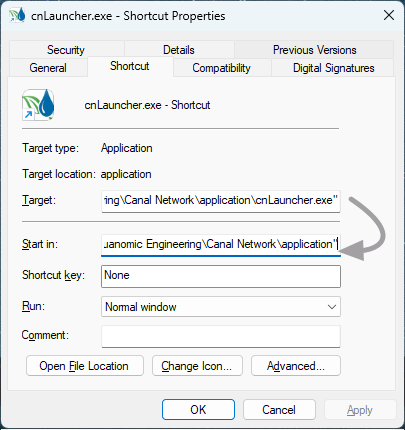

   In the *cnLauncher* dialog copy the contents in the ***Target*** field, and paste to the ***Start In*** field. Then, remove the last part of the text you pasted ***\cnLauncer.exe***.

5. Hit `Apply` and close the dialog..

Now, you are ready to lauch the application. 

*Additional Tip* To allow you to start cnLauncher from the Windows Taskbar, type cnLauncher and right click on the icon. Choose `Open File Location`. Right click again on the short cut, and shoose `Properties`, then repeat the same thing.

## Updating Your Product
[Back to ToC](#table-of-contents)

Launch your product, if not already. On first start, you may get *Update Required* dialog. This is normal.

   

1. Choose, ***Update Manually***, and point to the download folder where you have the update patch you downloaded above
    > :warning: The update patch must be provided as downloaded. DO NOT UNZIP.

   

2. This will automatically deploy the patches, and you should get an *Update Succesful* dialog.

   

## Licesning Your product
[Back to ToC](#table-of-contents)

The next step is licensing your product. Upon launch you will find the following interface.

>**Note:** You will need active internet connection to complete this action.

1. Choose Activate CanalNET online.

   

    :bulb: More direction will be added soon, for customers who want to purchase directly.

2. Then choose ***Activate Online*** option. 

   

3. Collect your license information.

   You can find this information [available at your customer portal](https://secure.softwarekey.com/solo/customers/Default.aspx?AuthorID=5025369). Once on the site, select `Licenses and Renwales`.

   

   This will open the following page. Click on your license ID, to view more details.

   

   Copy and paste the *License ID* and *Activation Password* in below step.
   
   

4. Provide the license details, and hit `Continue`.
   
     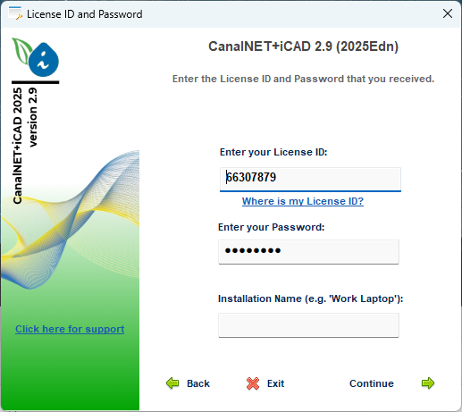

 5. The activation process will complete, and allow you to proceed.

      

The products interface is now available. 

   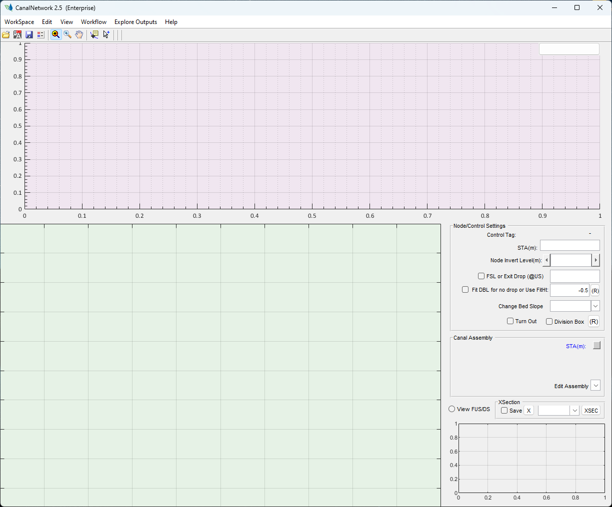

## Setup AutoCAD for use with iCAD and related products

 This is the final step, that allows you to seamlessly work with your AutoCAD application.If you don't complete this step, it is common to get the *Failed to Link* warning dialog whenever you attempt to do tasks that involve AutoCAD.

 For example, on your CanalNET application, go to `Workspace > Load Network` menu command. You will see one of the following messages.
 
 Scenario 1: If a running AutoCAD application is not detected while launching iCAD. That is normal, and continue by hitting `Ok` button. The application will start.

   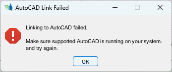

> :bulb: **Note**: If AutoCAD is running and the above dialog still appears, then the version of AutoCAD may not be supported. Install a supported version, and try again.

Scenario 2: If a running AutoCAD application is deteceted, the following dialog appears.

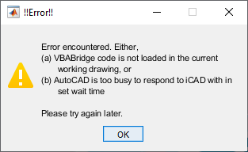

This happens because AutoCAD is not setup yet. Follow below steps to resolve this.

1. Check VBA enabler in your AutoCAD applicaiton. To check status, type *-vbaide* on your AutoCAD's command line. 

1. If an interface appears with out a dialog, your AutoCAD is ALREADY enables, and skip to the next step.

    If a dialog appears, asking you to download the feature, follow the link, download, and install it. Check using the command in step 1 above.

    > :Note: You may need to to restart AutoCAD or your PC to get the addon working. following dialog appears, 

1. In AutoCAD environment, go to the command line and input **-appload** command. AutoCAD will respond by invoking the *Load/Unload Applications* dialog.

     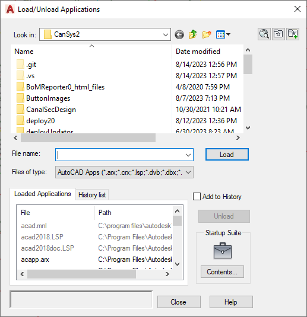

    Click on the `Contents` button in the *Startup Suite* pannel.
   
1. In the *startup suite* dialog, hot `Add` button.

     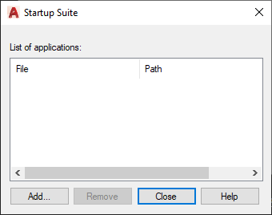

1. Navigate to the installation folder. 

    Start by right clicking on the desktop shortcut and click `Open File Location`. Click on the address bar, and copy the entire path to clipboard. Then under *Add file to startup suite* dialog of AutoCAD, right click on the path information and paste. Then choose **iCAD Bridge.dvb**.

   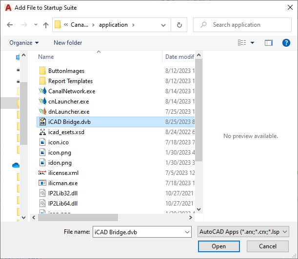

   > :bulb: The default path has the following format: ***C:\Users\<username>\AppData\Roaming\Quanomic Engineering\<Product Name>\application***.

1. The *Security* dialog displays. Choose `Always Load` button.

     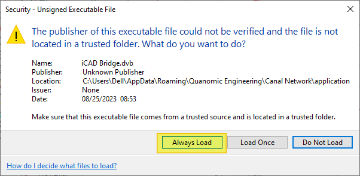

1. The Startup suite dialog now updates its contents listing iCAD Bridge.dvb in the list.

     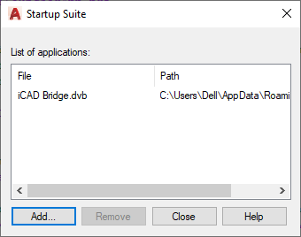

     Hit `Close` to finish.

 1. The *Load/Unload Applications* dialog confirms the operation at the bottom.

      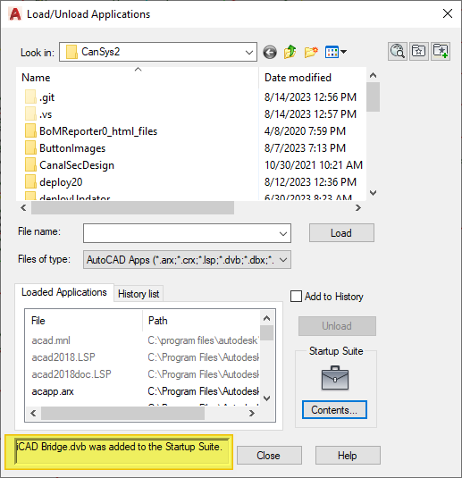

AutoCAD is now all-set to work with your product. It will always load this application on startup, and you will not have to do this setup every time.

[Back to ToC](#table-of-contents)

END.
