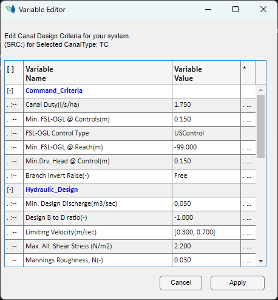

# 2. Data Preparation 
[Back to Home](../index.md#wellcome)

CanalNET builds on three data sets. These are:
- Topographic data (CSV format)
- Design Criteria (Manually Input)
- Layout map, preferably with farm parcel geometry (AutoCAD Drawings)

These data need to be prepared in a specific manner to be useful in design and analysis tasks. 

## Topographic Data
[Back to Top](#)

Topographics data must be prepared in CSV format, as Easting, Northing, and Elevation data for the first, second, and third cploumns respectively. As shown below,

There is no limit to the length of data sets for topo data. Note however that if you use MS Excel, the maximum data you can process (to save as csv format) is limited to [to do]

> **Note:** Topo data import process will not accept feature data, or more than three columns of data. Make sure your data is prepared in the acceptable format.

## Design Criteria

[Back to Top](#)

Design crtieria are a set of parameters that govern how design and analysis tasks are carried out to canal routes. CanalNET has a structured approach to building design criteria data, and even to save in to a file for repeated use. These include
- Command Criteria - such ad farm duty (l/s/ha), Min driving head to branch canals (m).
- Hydraulic Design Parameters - such as B/D ratio, Mannings Roughness, Limiting velicities(m/sec) and Freeboard provisions (m)
- Construction Variables - such as lining type, cutting profiles, filling profiles, side road provisions for canals.

These data must be ready for each generation of canal in the project for manual input. 

**Key Concept** CanalNET understands canals by generations. The parent canal is the first generation canal. All canals branching from the parent canal are second generation canals. And so on. 

*Figure: A design ctiteira for a teritiary canal in a project.*

Please look at the Annex section to learn about each criteirion, and how it is understood and used in design and analysis.

## Layout Map (AutoCAD)
[Back to Top](#)

Finally, the layout map for the canal network system is expected in AutoCAD. This is a drawing of all the canal routes in the irrigatio network, including farmblock geometry (if available). 

There are strict requirements that canal route alignments must meet for successful acceptance to CanalNET environment:

1. All routes are drawn using polyline command, and elevations set to 0. Any object drawn with the Line command, or as a 3d polyline, will cause errors in subsequent tasks, and will be excluded upon import.

2. All canal routes are drawn from upstream to downstream directions, and with a scale of 1:1 on the AutoCAD world coordinate system (WCS)

3. Routes can have curves, however, they must start and end with a stratight segment of at least 20m. 
   
   

   **Note:** All curves must be perfectly tangent on start/end, and radius must be greater than 20m. Else, the curve data is skiped upon import, and vertices are extracted at 5m interval. (This behaviour can be managed in project preferences.)

4. Avoid canal branches at short distances appart (\<= 5m). If found, they will be considered as a single two-sided branch. See best practices below for more on this.

    

 
5. If farm block geometries are to be drawn in AutoCAD, the following must be met:
   - Drawn using the polyline command, elevation at 0. (similar to routes)
   - No curves. If curves are found, points along the curve will be extracted.
   - Each geometry must cross the canal route serving water to it at least once.

While the AutoCAD drawing will often contain many other elements. The above guidance applies to objects intended for use with CanalNET. 

> **Tip:** Working on your AutoCAD file with CanalNET (or iCAD), does not affect your normal AutoCAD workflows in any way.

## Avoiding Pitfalls and Best Practices:
[Back to Top](#)

Ensuring the above requirements are met is critical to subsequent workflows. Failure to do so results in too much back and forth between CanalNET and AutoCAD, making the process inefficient. 
Best practices include:

1. Organization by layer: it is very helpful to collect canal routes of similar generation or level to one layer. This will greately enhance production tasks later. For instance, collect all TC (teritiary canals) to one layer *TC Canals*. Similarly, collect all quaternary level canals to an other layer *QC Canals*. And so on.

2. Branch Canals: The points where any two canals intersect will form a junction node. Due to negligience in layout drawings, often unintended nodes surface during analysis by CanalNET. To avoid dealing with these:
   
   * where two canals branch from a parent canal, make sure they start from the same point. 
  
        
  
        *Figure: Unintended nodes at the begining of closely located branch locations.*
        
        
  
        *Figure: Corrected presentation to avoid unintended nodes.*

   * All routes should end at sufficient distance from other canal routes.
   
   * Avoid branchs on curved segments of canal routes. While mostly not needed, on some occasions, this may require to manually id and manage intersections.

Observing the above prerequisits and recommended best practices helps save time and frustration during subsequent steps of your work. 

<!---
While using CanalNET, the amount of time spent to work on design, depends little on the size of the irrigation area or the number of canals. Rather it greately depends on how strictly the above guideline is adhered to in preapring the layout map.
--->

[Back to Top](#)

