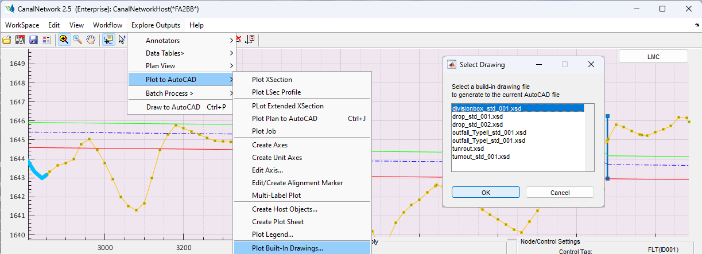
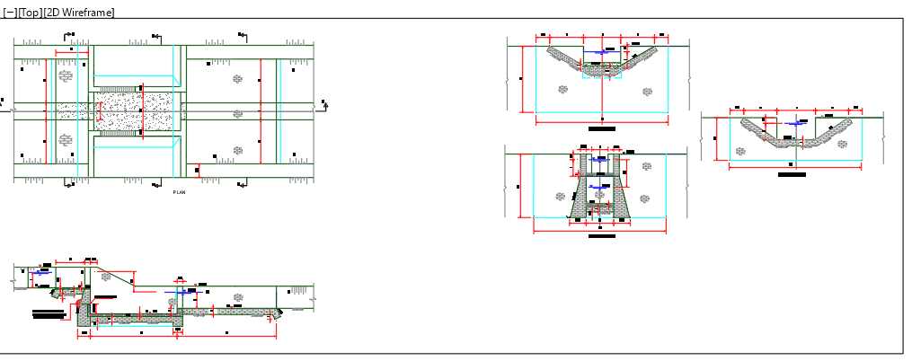

# Exporting Built-in drawings
[Back to Home](../index.md#wellcome)

CanalNET software has implemented standard structures as can be applied in different conditions in the entire network.
These standard structures include drops, turnouts, division boxes, and outlet structures. For these strucures,
a standaridized drawing are built in to the software.
Users can generate built in drawings from the installed resources as follows.

1. Make the desired autocad drawing to contain the imported drawings the current drawing.
1. Go to `Explore Outputs > Plot to AutoCAD > Plot Built_in Drawings...` menu command.  This will start the `Select Drawing` dialo as shown below.
    
    

1. Choose the desired drawing to import, and click `Ok`.
1. Back in AutoCAD, select an insertion point. The desired drawing is imported.

    

[Back to Top](#)