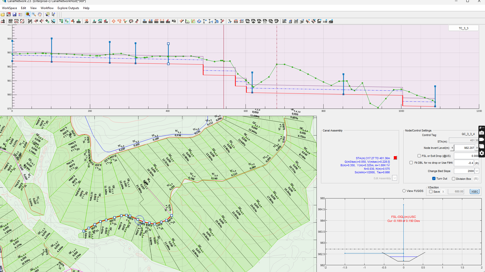
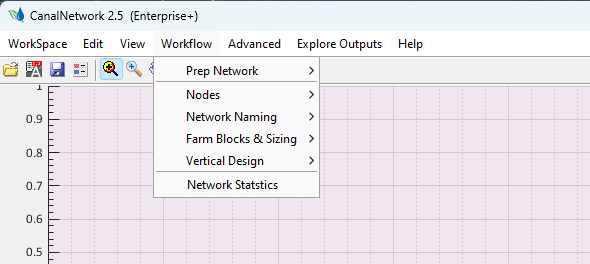
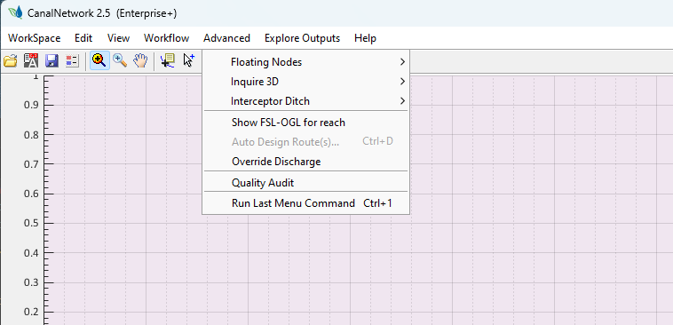

# 1. Introduction to CanalNET

[Back to Home](../index.md#1-wellcome)

Well come!
<!--
If Preview window is not working, disable any pulgins. Right click on any .md file, and choose Mark Down Editor, also choose Set to default.
-->

<!--- Work on these as you get time.

[  ] DOC: When updating, start from CanalNET. Proper message if from drainNET
[  ] DOC Resize fcn recalculate discharge, canal section by reapplying design criteria. Hence most node info are reset (CBL, drops, ioInvts(1), ioInvts(2),...)
--->
---
CanalNETWORK is a software product that offers targeted solution to the design, analysis and documentation of a system of gravity canal networks. It is designed and built by engineers, for engineers - with understanding of the practice of irrigation systems design, as well as governing theory in open channel hydraulics. 

This chapted introduces its features and capabilties, required data and system, its operating limits. More detailed information is covered in subsequent chapeters.

This chapter introduces the following topics:
- Features and Capabilities
- Computer System Requirements
- Software Operating Limits
- How to use CanalNET Software

## Features and Capabilities
[Back to Top](#)

CanalNET is a unique software. AMong many of its features, the following stand out:

- **All-in-one:** Allows engineers to handle designing, analysis, and reporting from one platform (with out the need for additional toosl).
- **Smart Networks:** It is built to understand and operate on canals as networked elemements - instead of the commonly fragmented (individual canals) approach with other solutions in practice.
- **Auomation:** Automates 99% of design tasks, saving design time, and allowing engineers to focus on what is really important - quality designs!

It also comes with strong tool sets for design verification, quality assurance, and construction solutions. The chapters that follow share the ways in which using CanalNET can benefit engineers and firms in achieving quality project formulation and execution.

*Figure: CanalNET interface, showing the layout view (bottom lect), profile views (top), and detail cross section views (bottom right).*

CanalNET can be used for system of open canal irrigtion network (supply only, there is a complimentary product DrainNET for drain networks.) It offers:

* Canal network connectivity analysis, and automatic generation of labels /tags for entire network

* Complete and detailed Longitudinal design of individual canal routes

* Automated generation of detailed and summary bill of quanity

* Automated generation of different drawing products

* Collaboration between enginners and team leads to tackle large scale projects

* Compact saving and sharing of design data

* ... and more.

## Computer System Requirements
[Back to Top](#)

Installation and use of CanalNET software is recommended on computers meeting the following minimum system requirements.

- Machine: Core i7, 9th Gen, or highter
- Architecture: X64 
- RAM: 8GB
- GPU: 4GB
- Hard Disk (SSD Recommended)
- Screen resolution 1080x1980 (FHD). Two monitors recommended for working with AutoCAD side by side.

In addition, AutoCAD software is essential, and serves as the main data input and production output terminal for CanalNET (and related products). Working with different AutoCAD versions is possible. Note the following:

- iCAD and CanalNETWORK products are fully tested on AutoCAD 2018 version. However, users have applied them using AutoCAD 2020, 2022, 2023 versions. This include Civil3D products, started as AutoCAD apps.

- If there are multiple versions of AutoCAD installed on a machine, CanalNETWORK product links to the current open version, and retains this version through out the session. It will not work with other versions opened after this. To connect with other versions, restart the CanalNETWORK application.

## Software Operating Limits
[Back to Top](#)

CanalNETWORK software has the following operating limits while in use for any network formulation and analysis.

- Manning's equation, and regime methods of analysis are available for flow analysis and canal sizing
- A parent canal cannot have more than two branches at a location.
- Flattest slope possible 1/10,000
- Steepest slope possible 1/100
- Maximum allowable canal side slope 5H:1V
- Thineest canal lining 0.001M, Thickest Canal Lining allowed 50Cm thick
- Maximum number of Canal Generations 10 Gens
- Minimum length of canal routes acceptable is 25m.
- Minimum acceptable curve radius is 20m.

> :Tip: You can learn more on these on the chapter on Design Criteria.

## How to use the Software
[Back to Top](#)

### Input Data
[Back to Top](#)

CanalNETWORK software handles detailed design task for an system of irrigation canals, whose layout has been well prepared. It does NOT include solution for creating layout of canals. The following data are required to start using the software:

* **A canal layout** drawing on AutoCAD: This provides the basis for the design of network of canals as a system.

* **Topo cloud data** (from surveying or other source): that is used to generate profile data for longitudinal design

* **Design Criteria** for the project: that provides detailed values of reference criteria and other governing factors (e.g., duty, slope, limiting velocity...)

### Standard workflow
[Back to Top](#)

Using CanalNET on a given project data is simple and intutive. Each step is achievable by invoking the menu items consequetively in their order of appearance. 

It follows the following structures steps:

1. **Prepare Data** This initial step involves cleaning drawings on AutoCAD and organizing object in layers, preparing top data in to acceptable formats (*.csv), and establishing design criteria values.

2. **Network Resolution** includes two steps: 

    - Node ID: The first automated process establishes the connectivity between canals, identifying which canals are a branch to which parent canals.
    - Naming: A fully automated step that assigns names to each canal route in the network.

    Usually, this process is iterative, requiring modifying data, and redoing NodeID + Naming, The network is accepted when the desired naming is applied with out any errors.

3. **Network Sizing** Here, farm block/parcel data can be imported (from AutoCAD), or automatically created. Based on the area served, the design discharge capacity of each segment in the entire network is calculated (automatically).

    $ Q_i= Duty *A_i$

1. **Longitudinal Design** or **Vertical Design**. CanalNET generates ready to edit designs by using topographic data, hydraulic data (from sizing)  and design criteria settings. At this step, engineers simply refine and finetune. One can easily see where performance criteria is met (e.g., velocity, shear stress limits), or construciton criteria (e.g., drop spacing and minimum foundation depth)

1. **Production** is done from `Explore Solutions` menu usingg `> Data Tables`, '`> Plot to AutoCAD`, and `> Batch Process` commands. On this final stage, submission ready products are produced. These indlude Bills of quantitiy documents, LSec or Profile Drawings, Plan views, cross-sections, and typical drawings for structures along with dimension tables. This is fully automated process, enhanced further using batch processing feature.

### Advanced Analysis
[Back to Top](#)

CanalNET offers the following advanced features for indepth analysis, optimization, and overall project quality assurance.

1. **Alternate Route** Alternate alignment routes can be created and analyzed for quantity/cost.

1. **Clash Detection** or constructability checks allow to examine and explore the interplay between parallel running canals for potential overalp. 

1. **Gradient Search** a powerful approach to automatically create optimal alignments for canals.

1. **Design Quality Check** automated tool to verify network wide performance against set design criteria, and field performance criteria (e.g., phreatic line checks)

> **Note:** The availability of advanced features may depend on the license tier issued.

**Lets get Started!**

The software can be [downloaded here and setup by following the the step-by-step guidances here.](#)

[Back to Top](#)

