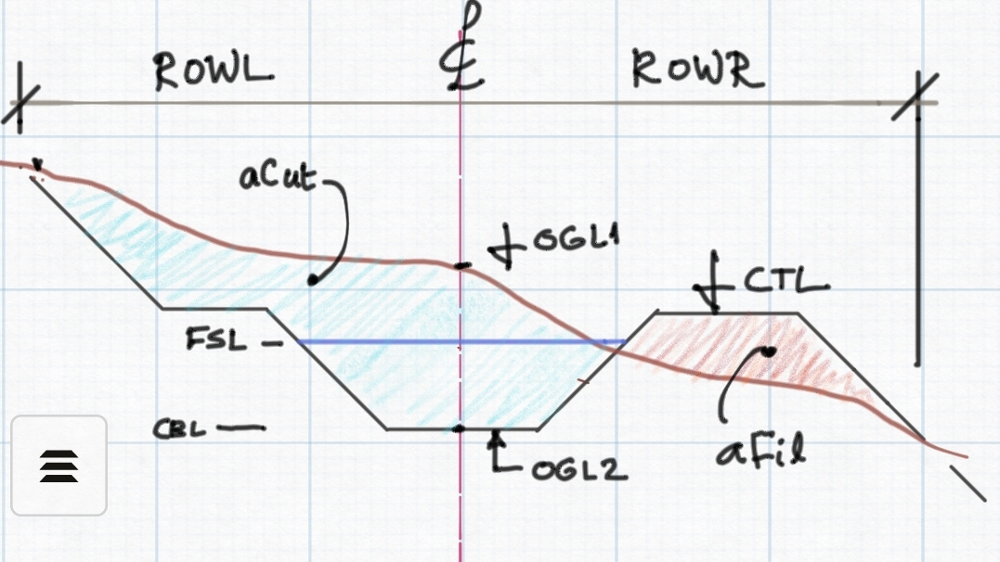
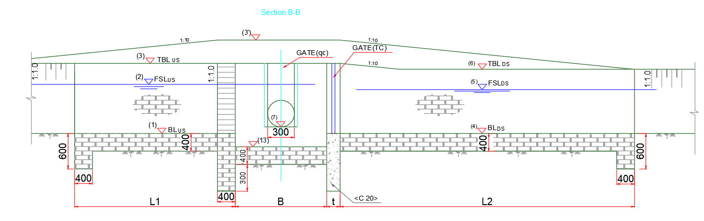
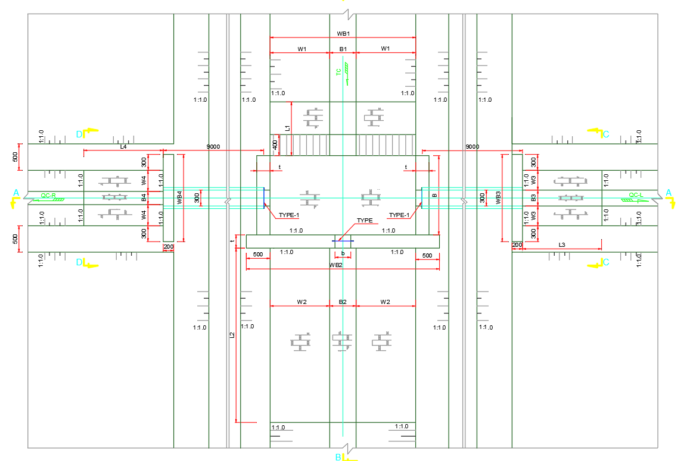
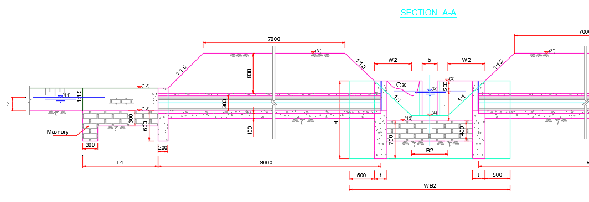

# Exploring Longitudinal/Vertical Designs
[Back to Home](../index.md#wellcome)

## Introdution

There are multiple ways to explore and interact with the solutions of a longitudinal profile (vertical) design of a canal route. These include data tables, visualizations and reports. They assist to guide the engineer's action to formulate better projects. They include:
- Location, size and dimension of structures
- earth work information, as well as detailed quantity estimates
- hydraulic details

Batch processes are also available to automate these processes.

The tools are all accessible from the menu `Explore Solutions`.  These are categorized in to two groups, annotations and data tables.

## Creating and Managing Annotations
[Back to Top](#)

Users can create and manage various annotations to keep track of the changes happening, as well as ensure key criteria are met.

To show drop heights,  FSL-OGL value at controls, 

* Go to `Explore Solutions > Annotations > Drop Heights` to show drop heights for generated drops.

* Go to `Explore Solutions > Annotators > min FSL-OGL` to calculate FSL-OGL value at each control and render values by color in comparison with design criteria value.

To show hydraulic annotations such as OGL, CBL, FSL inforation:

* click on the appropriate annotator from `Explore Solutions > Annotators` and interactively position the cursor line. The results will be displayed.

An other imporant annotation available is cut and fill volume annotator, shown above. This tool can cumulate volumes of earth work for entire reach or between selected stations giving an insight in to the cost of the design. To view volume informaiton:

* Click on` Explore Solutions > Annotators > VCUT, VFIL` menu item. 

Note: If there are annotation markers in the profile view, then the partial volumes are automatically calculated and displayed. In such cases, all markers with in 100m of start and end station, or 100m distance between are ignored - i.e.,  do not affect the partial volumes calculated. The values are interpolated between succesive stations, and hence are accurate only at data stations. 

> **Important Note:** Volume calculations are accurate when the markers are placed on data points. Results for intermediate points are interpolated and may not be accurate.

Yet another helpful annotation is available from `Explore Solutions > Annotatiors > LSec Details`. This will display details of the longitudinal design including station range and flow section details for each segment of route. In addition it also annotates canal curve information if avaiilable.

 

The above described annotations provide a quick and reliable overview of the hydraulic status of the canal. Some of the annotations also vary dynamically along with design changes by the user, to help decide whether design objectives are met.

> Note: The above annotations can easily be accessed with the following short cuts.
> 
> 
> 
> Ctrl + 1: Display on/off drop heights
> 
> Ctrl+2: Display on/off Min FSL-OGL states at controls
> 
> Ctrl+3: Display on/off LSEc Details

## Viewing and copying table data
[Back to Top](#)

The other group of tools to explore solutions is viewing tabular data. The solution for longitudinal design of routes incorporates tabular data. These are accessible from Explore Solutions > Data Tables. There are five table data available for viewing.

### LSec Profile Data
[Back to Top](#)

This table shows extensive detail of profile data along with canal bed level and embankement formation data for the entire range of stations in the route. 

Note: The data are tabulated at exactly the same incremental stations generated during profile extraction. 

It is also important to note the following additional refinements, that are not specified by the user, rather applied in run-time.

(a) the data is further refined at additional stations, for:

- control locations, including floating nodes.

- Drop structure locations

(b) calculations in transverse direction depend on the offset data interval during profile extraction. However, additional refinements are applied to the transverse data set if:

- the number of offset locations is less than 5, and

- the applied refinement is -15:3:15 in conventional notation, or -15, -12, -9, -6, -3, 0, 3, 6, 9, 12, 15.

> :bulb: **Tip**: If the table does not display data, or does not update its content, try closing it and running `Workflow > LSec Profile` or `Ctrl`+`L'. This should display the results.

In the table:

**Chainage**: Station locations where data is extracted (See below note.)

**xOfst=0.0:** OGL at centerline

**CBL:** Canal Bed Level value at the station

**CBL2:** Final excavation or fill level at a station, after considering canal lining thickness (if used.) If no canal lining is used, CBL and CBL2 contain the same values for a given station.

**hFil:** Height of fill caculated as CTL less OGL at centerline

**hCut:** Height of cut calculated as OGL less CBL2 at centerline

**aFil, aCut:** Area of fill and Cut work, respectively, at the particular station.

**CTL:** Canal Top Level

**FSL:** Full Supply Level

**ROWL, ROWR:** End of fill or cut lines on ground surface measured from the centerline of the canal to the left, and to the right respectively.

You can copy the table using the `Copy Table` button at the bottom, and paste it to an other applicaiton such as MS Excel or Word, for further processing.

> Note: The station listing in the data table is extended to include control and drop locations, in addition to the station marks specified during profile extraction stage.

The table headers are explained in below schematics.

*Schematic of a typical canal cross-section, showing details for unlined canal.*

*Schematics of a typical canal cross-section, showing details for thin (left) and Thick (right) lined canals.*

aCut and aFil are determined by working out an exact analytical replica of the above geometric arrangement, and calaculting the area bounded in the corresponding regions. Typically, the analytical geometry is worked out for:

* a prevailing OGL (transverse profile)

* designed canal section geometry, such as bottom width, side slope and canal depth.

* superposed with values of *Cut Shape* and *Fill Shape* values input in construction variable settings, such as working space (in case of linings), berm width, cut/fill slopes and heights, number of berms, etc.

Hence, all results of the table can be considered an accurate representation of the built condition, given the transverse profile adequately represents the expected terrain variation at the particular station.

Bill of quantitiy estimates for earth works are estimated by cummulating areas of cut and fill at each succesive station, and applying the trapezoidal method. This method utilizes the approximation used for 'numerical integration', that breaks down areas in to trapezoids with more easily computable areas. 

The trapezoidal method of volume estimation generalizes to:

where x1, x2,... xn represent the station locations for the corresponding aCut and aFil funtion values. 

Note: Cart away volumes reported on BoQ table represent the total excavated/Cut volume multiplied with hardcoded loosness factor of 1.2.

See Design Production Section for  more information ob BoQ estimation, and how clearing depth is considered.

### Exploring Flow Sections
[Back to Top](#)

This command generates the hydraulic design results for flow sections corresponding to each segment in the canal route.

In the table, 

**STA:** Station range of the flow section

**Q**: Designed Dicharge capacity of the flow section, m3/sec

**N**: Manning's roughness coeficient

**FSD**: Full supply depth, or Flow depth calculated by solving mannings equation.

**FB**: Freeboard used

**So**: Design bed slope

**m**: Side slope of the flow canal section

**B**: Designed Bottom Width of the canal seciton

**B/D ratio**: The ratio of bottom width to depth used to design the flow section

**A, P, Hyd.R**: Wetted Area, Perimeter, and Hydraulic Radius of the flow section for the above dimensinos

**V**: Flow velocity for the flow section

**Vchzy**: Chezy's flow velocity calculated for the flow section

**Vratio**: Ratio of the two velocities calculated. ECSDWC design guideline recommends that that this ratio must be close to 1.

**Taw**: Calculated maximum anticipated shear stress for the flow section.

> Flow sections can be generated to an AutoCAD environment as detailed drawings, by linking to iCAD's CanalManning module.

Also:

V: represents actual flow velocity in the canal section

Vchzy: Chezy's flow velocity in the canal section, estimated from:

v= c x (R/So)^(-1/2), and

c= NxR^(-1/6)

Vcr: Criteria velocity estimated from:

Vcrt= 0.546*y^0.64

Vratio: Velocity ratio determined from 

Vratio= Vchzy/Vcrt

Some practitioners recommend to accept design sections whose value for velocity ratio is close to unity.

### Exploring Controls
[Back to Top](#)

This menu command generates a list of all the controls in the canal route, that define the connection between succesive segments, as well as junction with brnach canals - if any.

In the table, the following defintions apply to the terms listed:

Type: The function of the control, set to either Turnout or Division box.

US Invert: the invert level, or the CBL, just upstream of the control location.

DS Invert: the invert level, or CBL, just downstream of the control location. This accounts for any Exit Drop Height specified for the control - if any.

Fall Height: The difference between US and DS invert levels

FSD: Flow depth for the flow section corresponding to the segment upstream of the control location, and

FSL: the full supply level just before the control location.

### Exploring Drops
[Back to Top](#)

Similar to above commands, this command list all the vertical fall structures for the route.

The table contains a rather long list of parameters for each drop:

Station: Location of the drop structure

<u>Discharge</u>: The design flow capacity of the drop passing through the structure.

<u>Crest Ht</u>: The height of the over flow crest above the US Invert level for the drop.

<u>Crest Width</u>: The width of the drop structure just before the overflow span at the crest, also extending to the stilling basin compartment.

<u>Fall Height</u>: The elevation difference between the US (Inlet) and DS(Outlet)  invert level of the drop, as defined below.

<u>Inlet, Outlet</u>: the invert level, or CBL, just upstream and DS of the drop location, respectively.

<u>Notch WIdt</u>h: The width of the overflow section just at the crest.

<u>Sill Height</u>: The height of the end sill provided for the drop, just before joining the continuing (downstream) canal reach

<u>Basin Length, WIdth</u>: The length, and width of the stilling basin to be provided

<u>Basin Thk</u>: The thikness of impervious floor to be provided under the stilling basin to ensure safety  against excessive uplift pressure. (this is dertermined assuming massonry material with a unit weight of 22KN/m3)

<u>US, DS Cutoff</u>: Depth of cutoff wall provided at begining and exit of the drop structure.

<u>Protection Length</u>: Recommended length of protection layer to be provided both upstream and downstream of the drop structure.

*Figure: Details of a Drop Structure from ECDSWC, and some of dimensions included in the standard output of Explore command.*

It is possible to extract the drops of a number of canal routes in one go. To do this, select all the routes whose drop list is desired, and invoke the command `Explore Solutions > Data Tables > Explore Drops`.

### Exploring Turnouts
[Back to Top](#)

**Since Feb2025, a new type of turnout is implemented

This option specifically lists the relevant construction dimensions for each turnout structure found on the route. 

The symbols in the table represent the dimensions corresponding to the standard turnout design drawing developed and in use by ECDSWCo (2024). The drawing is shown below.

*Figure: Tunrout Structure TYPE-I detail drawings from ECDSWCo, with dimension detail corresponding to the symbols in the explore output table.*

<u>**Notes on BoQ calculation for Turnouts**</u>

The calculation of quantity items for turnout structures is based on the sizes of the canals involved, and some fixed parameters in the reference resource. The following are key paramters used, also indicated in the drawing above.:

* Thickness of lining and cutoff walls (upstream and downstream) set to 0.40m

* Thickness of notch wall is set to 0.25m

* The depth of cut for earth excavation calculation is calculated from:

    dFloor= OGL at control location (centerline) - lowest excavation level, where lowest excavation level is estimated from bed level of lowest canal bed (upstream od downstream, especially for turnouts with falls), less 0.40m thickness of bed lining, less compacted backfill height provided in Control_BoQSettings (under network preferences).

The cut volume is calculated using:

- dFloor

- Ltotal=6.0m

- BTotal=2*(THK + b1) + B1;

- Working space, and m values from control_boqSettings

Thus:

Vcut= dFloor x (LTotal+mxdFloor) x (BTotal + mxdFloor)  

> **TURNOUTS with DROPS**: Tunrouts can be combined with drops. The outputs will use combined drops ONLY if the exit drop provided is > 0.10m. In such cases, the stilling basing structure will be sized and provided following the set drop design method (Chow's method is default). The results are included in BoQ quantity.

### Exploring Turnouts (New)
Since Feb2025, we have introduced a new type of Turnout structure, with piped offtake to branch canals. The hydraulic design principles for this turnout is similar to the previous ones, i.e., based on minimum driving head specifications in the design criteria. 

The following are key considerations:

- Outlet elevations are fixed by using minimum diving head specified in Design Criteria
- Pipes are laid at the same slope as the (first segment of) the branch canal.
- Pipe inverts for a branch canal are determined as the minimum of wither the CBL, or the expected normal flow level in the pipe(s). 
- Flow depths in pipe can not exceed 80% of the pipe diameter. If encountered, more number of pipes are provided automatically.
- Turnputs combined with drops are allowed. The drop fall is applied after the box.
- The width of the gate to the continuing canal, if exists, is equal to the bottom width of the canal.

Limitations:

The following limitations are part of the current release. These will be improved in future releases.

- the quantity reported for all components is calculated based on one pipe outlet design. If more than one pipe is provided, the pipe quantity is reported accordingly, but other componetes remain the same.
- BoQ estimates do not include reinforcmenet bar that may be necessary for concrete components.

Conventions
-	First node corresponds to the left in drawing, reordering can be used to change this. This will also govern the BoQ calculation (multiplied by two to determine the right side)

*Fig: Plan and section view of the turnout strucrure, obtained from EEC.*

Note that the following are hard coded constants:

- Pipe Diameter 300
- Pipe Length 9m
- N for concrete 0.014

THK_box= 0.40;
      THK_canal=0.30;
      depth_concrete= 0.30;
      Thk_conc= 0.20;

      % Assumed dimensions
      dia_pipe= 0.30; thk_pipe= 0.05;
      width_concreteBed= 0.30; % assumed equal to pipe dia
      depth_stillPool= 0.10; %depth of stilling

Exploring the drops now gives an extended table of results, with 25 columns. A typical output is shown below (transposed for ease of presentation)

 

### Exploring Division Boxes
[Back to Top](#)

Similar to turnouts, this command specifically lists the relevant contruction dimensions for each division box structure found on the route.

The symbols for each dimension heading is described in the below drawing.

*Fig: Drawing for a typical division box from CDSWC, showing the deginition of symbols used in the table listing.*

### Copying table data and using in other applications
[Back to Top](#)

All the data presented in the form of a table can be used in other applications, e.g., report writing in MS Word or further data processing in MS Excel. The `Copy Table` button provided at the bottom of the table display interface just helps do that. To copy the data content of the table view interface, click on the button.

Choose your preference as shown above, and jit Ok. The data is copied to the Windows Clipboard. You can now paste the data to your desired application and use it.

## Viewing BoQ data for a route
[Back to Top](#)

After the above solutions are explored, a complete BoQ information can be generated for a route as follows.

1. Start the command from `Explore Solutions > Data Tables > Generate Route BoQ`. 
   
   

2. This will extract all available informations, and request output specifications.
   
   

3. The report is generated per specified output format.
   
   

> Note: If all solutions are not explored, generated BoQ may not be complete, or not succesfully reported at all.

More detail is available under the Topic [Design Production].

## Batch Explore of Solutions
[Back to Top](#)

Exploring solutions is desired to analyze and confirm the outputs are acceptable, or if there are modifications required to the design. It is also important for production tasks. However, it can be tedious to run all the above commands for each canal in a network of canal systems. To assist in this process, batch processing options are available. This allows to automatically run the solutions for a number of canals at a time, and update the data contents for each route.

To use this tool, to explore solutions for sub canals of a route:

1. Select the parent canal in layout view. In the figure below, a secondary canal is selected. 
   
   Start the command from `Explore Solutions > Batch Process > Batch Explore SubRoutes...` 
   
   

2. Choose the level or generation of canals whose solution is desired, from the dialog below. The immediate generation TC is selected in this case.
   
   
   
   Your choice is confirmed in the dialog displayed. Confirm action by clicking on `Go` button.
   
   
   
   This will run each of the branch canals for the above list of solutions, namely - Lsec profile data, drops, turnouts and divisionboxes. In the process BoQ data is updated and stored.
   
   When no components are found on a given route, the following dialog appears to provide the information.
   
   

3. Once all routes in the specified generation are complted, the completion dialog shown below is displayed.
   
   

## Creating and Viewing Cross-section views
[Back to Top](#)

One can easily view the cross-section at any station along the canal route. To view cross-sections, make sure the desired route is selected in plan view, and its details are presented in profile view. Then:

Toggle on the `XSEC` button near the detail view area.

if the Lsec data is not created yet, the following message is thrown. 

Create the data from Explore Solutions > Data Tables > LSec Profile Data. Then try again.

A vertical broken line is created at station 150 by default on the profile view. Click on the line to generate the cross-section on that station. The line will change to a solid line, and the cross-section is displayed.

To view cross-sections at other stations, click onthe solid line. An interactive location bar will be displayed. Click on any desired station, and the cross-section at the new location is generated.

The stations viewed can be saved for latter use. To save selected stations, click on the Save check box on top of the detail view. This will make sure that every station picked is saved. Such saved stations are made availble any time when clicking on the route, and can be exported to AutoCAD.

 Learn more about this on documentation for Design Production.

[Back to Top](#)